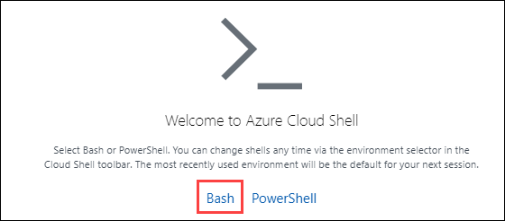
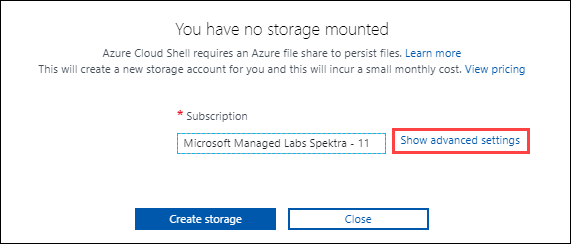
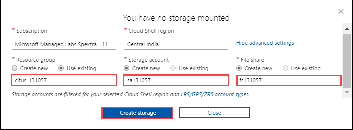
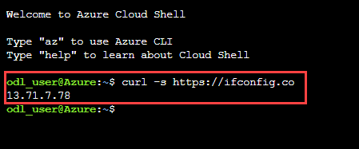

# Getting started with Hyperscale (Citus)

### Lab 2: Create a Cloud Shell

1. On the portal banner click on the **Cloud Shell icon **.

   

2. On the Welcome to Azure Cloud Shell click **Bash**.

   

3. On the You have no storage mounted screen click **Show advanced settings**.
 
   

4. Use the default values for subscription and region and for:
* Resource Group - Select **Use Existing** that is **citus-xxxx**
* Storage Account - name for storage accound should be unique, **sa131507**
* File Share - name for storage accound should be unique, **fs131507**
Then click **Create**.

   
  
 > **Note**: This may take up to a minute to create and start the Cloud Shell.
   
8. We will need the client IP address of Cloud Shell to configure the firewall in the next step. At the command prompt enter the following 
command and press return then copy or note the IP address of your cloud shell.

```
curl -s https://ifconfig.co 
```

   

> **Note: To paste in the bash console right click and choose paste.**

9.	Click **Next** on the bottom right of this page.
