# Connecting to Hyperscale(Citus) on Azure Database for PostgreSQL

When you create your Hyperscale(Citus) a default database named citus is created. To connect to your database server, you need a connection string and the admin password. Initial connections may take up to 2 minutes. 

If for any reason your shell times out and you restart it you will need to perform the ```curl -s https://ifconfig.co``` command again and ensure the firewall is updated with the new IP address.

## **Lab 4: Connect to the database using PSQL**

1.Navigate to **Home** in Azure Portal. Then under Azure services click **Azure Database for PostgreSQL servers**. 

  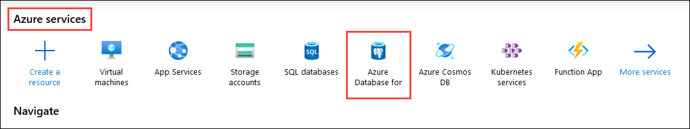

2.Select the pre-cretead database **postgresxxxx**.

  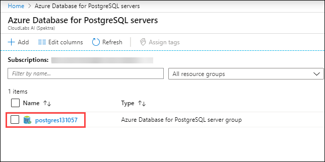

3.Select **Connection Strings** under **Security** pane. Then copy the connection string given under **psql** and paste it in a text editor.

  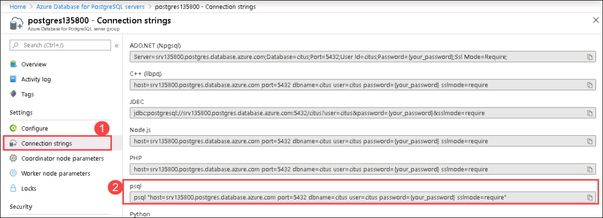

4.Replace **{your_password}** with **Password123**. The final connection string should look similar to the one shown below. 

```
psql "host=srv135800.postgres.database.azure.com port=5432 dbname=citus user=citus password=Password123 sslmode=require"
```

5.Paste the connection string in bash console and press **enter**. You will get connected to **Citus** database server.

  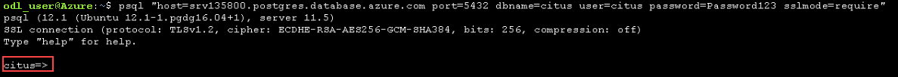
  

### **Create and scale out tables**

Once connected to Hyperscale(Citus) coordinator node using PSQL, you can complete some basic tasks.

In this experience, we'll primarily focus on distributed tables and getting familiar with them. The data model we're going to work with is simple: user and event data from GitHub. Events include fork creation, git commits related to an organization, and more.

6.In the bash console copy and paste the following to create the tables. Then press Enter.

```
CREATE TABLE github_events 
( 
    event_id bigint, 
    event_type text, 
    event_public boolean, 
    repo_id bigint, 
    payload jsonb, 
    repo jsonb, 
    user_id bigint, 
    org jsonb, 
    created_at timestamp 
); 

CREATE TABLE github_users 
( 
    user_id bigint, 
    url text, 
    login text, 
    avatar_url text, 
    gravatar_id text, 
    display_login text 
); 
```

  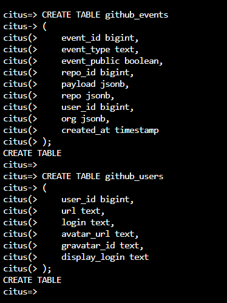

The payload field of github_events has a JSONB datatype. JSONB is the JSON datatype in binary form in Postgres. The datatype makes it easy to store a flexible schema in a single column, and lets you query JSON elements directly and perform complex logic on values within. Postgres can create multiple advanced indexes here, including GIN indexes which index every key/value pair within the JSONB element. With an index, it becomes fast and easy to query the payload with various conditions.

Let's go ahead and create a couple of indexes before we load our data. 

7.In the bash console copy and paste the following to create the indexes and press Enter.

```
CREATE INDEX event_type_index ON github_events (event_type); 
```

```
CREATE INDEX payload_index ON github_events USING GIN (payload jsonb_path_ops); 
```

  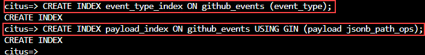

Next we’ll take those Postgres tables on the coordinator node and tell Hyperscale (Citus) to shard them across the workers. To do so, we’ll run a query for each table specifying the key to shard it on. In the current example we’ll shard both the events and users table on user_id.

8.In the bash console copy and paste the following and press Enter.

```
SELECT create_distributed_table('github_events', 'user_id');
```

```
SELECT create_distributed_table('github_users', 'user_id');
```

  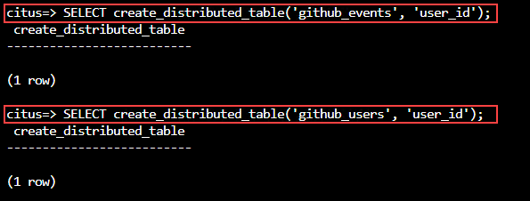
  
This command splits each specified table into a series of shards on the worker nodes. Each shard is a simple postgresql table that holds a set of users (as we sharded on user_id). It also creates metadata on the coordinator node to keep track of set of distributed tables and locality of shards on workers. As we sharded both the tables on user_id the tables are automatically colocated. This means that all the data related to a single user_id for both tables is on the same worker node. This helps when performing joins between the 2 tables locally on the worker nodes across the colocated shards.

> **Note**: Within Hyperscale(Citus) servers there are three types of tables:

-	**Distributed Tables** - distributed across worker nodes (scaled out). Generally large tables should be distributed tables to improve performance.
-	**Reference tables** - Replicated to all nodes. Enables joins with distributed tables. Typically used for small tables like countries or product categories.
-	**Local tables** - tables that reside on coordinator node, administration tables are good examples of local tables.
We're ready to load data. The following commands will "shell" out to the Bash Cloud Shell and download the files.

9.In the bash console copy and paste the following and press Enter. This will download the data files.

```
\! curl -O https://examples.citusdata.com/users.csv
```

```
\! curl -O https://examples.citusdata.com/events.csv 
```

  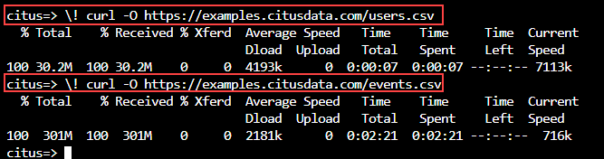
  
10.In the bash console copy and paste the following to load the data files.

```
\copy github_events from 'events.csv' WITH CSV 
```

```
\copy github_users from 'users.csv' WITH CSV 
```

   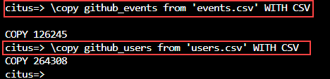
    
For heavy production workloads, the COPY command is faster in Hyperscale (Citus) than single node postgres because COPY fans out and runs in parallel across the worker nodes.

### **Run queries**

Now it's time for the fun part, actually running some queries. Let's start with a simple count (*) to see how much data we loaded.

11.In the bash console copy and paste the following to get a record count of github_events.

```
SELECT count(*) from github_events; 
```

  
  
The coordinator automatically refactored this query using the shard key of user_id that you specified earlier. This allowed it to run the count locally on each shard of the table, add up the results, and give you a very fast response.

Within the JSONB payload column there's a good bit of data, but it varies based on event type. PushEvent events contain a size that includes the number of distinct commits for the push. We can use it to find the total number of commits per hour.

12.In the bash console copy and paste the following to see the number of commits by hour.

```
SELECT date_trunc('hour', created_at) AS hour, 
       sum((payload->>'distinct_size')::int) AS num_commits 
FROM github_events 
WHERE event_type = 'PushEvent' 
GROUP BY hour 
ORDER BY hour; 
```

  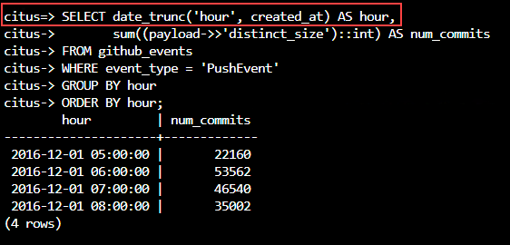
    
> **Note**: If you are stuck in the results view, type q and press Enter to quit view mode

So far the queries have involved the github_events table exclusively, but we can combine this information with github_users. Since we sharded both users and events on the same identifier (user_id), the rows of both tables with matching user IDs will be co-located on the same database nodes and can easily be joined. If we join our query on user_id, the Hyperscale (Citus) controller will push the join execution down into shards for execution in parallel on worker nodes.

13.In the bash console copy and paste the following to find the users who created the greatest number of repositories.

```
SELECT login, count(*) 
FROM github_events ge 
JOIN github_users gu 
ON ge.user_id = gu.user_id 
WHERE event_type = 'CreateEvent' AND payload @> '{"ref_type": "repository"}' 
GROUP BY login 
ORDER BY count(*) DESC LIMIT 20; 
```

  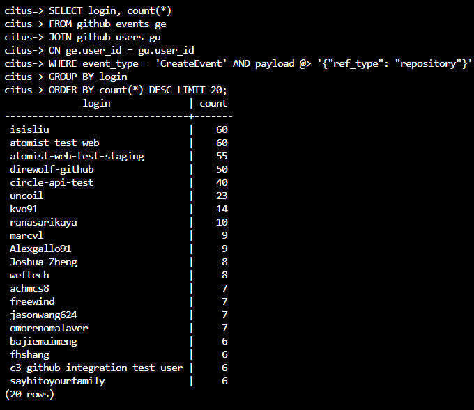
    
Several of the capabilities and design decisions shown above are well suited to production workloads on Hyperscale (Citus) environments. By keeping shards and their indexes small, we are able to increase index and cache hit rates, aiding resource utilization. By having a series of worker nodes sharing the load, we are able to greatly increase parallelism as well, allowing for significant performance gains.  

14.Click **Next** on the bottom right of this page.
