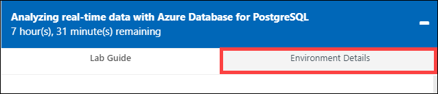

# Getting Started

## **Lab 0: Sign in to the Azure portal**

1. Launch **Azure Portal** (https://portal.azure.com) in the desktop on left side. You can use the shortcut on the desktop. You'd be asked to choose default browser configurations, You can skip those for now by clicking cancel.

2. Use the azure credentials provided in the **Environment Details** tab to log in to the portal.

   
   
3. Refer the **Environment Details** tab for any other lab credentials/details.

4. There will be a pop-up entitled **Stay signed in?** with buttons for **No** and **Yes** - Choose **No**.

5. You may encounter a popup entitled **Welcome to Microsoft Azure** with buttons for **Start Tour** and **Maybe Later** - Choose **Maybe Later**.

6. You are provided with a pre-created **Hyperscale (Citus) database**.

7. Click **Next** on the bottom right of this page.
